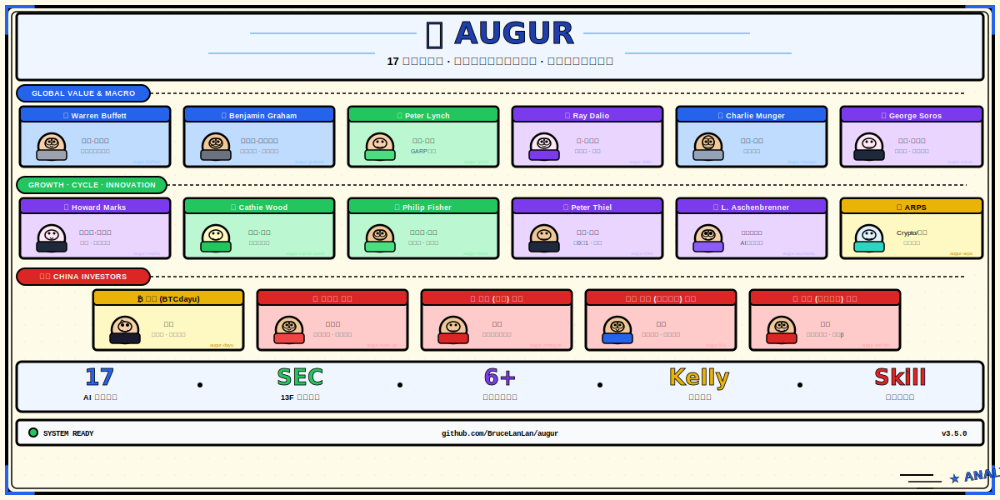
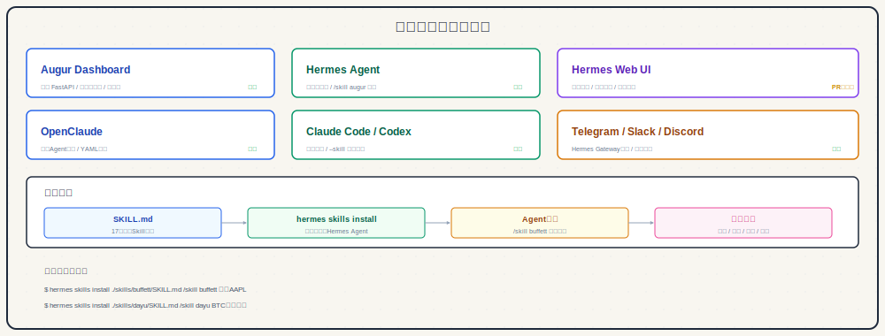
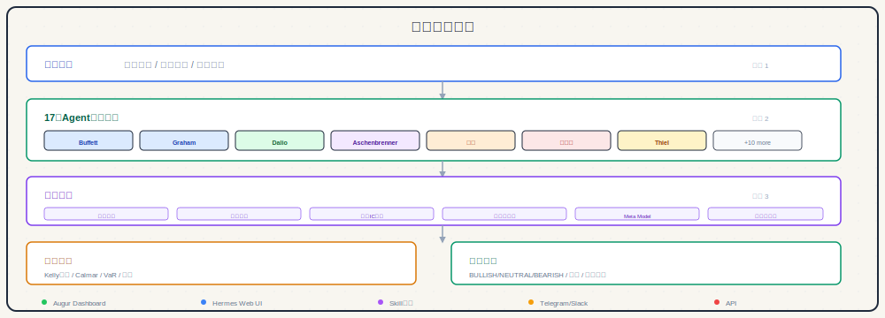

<p align="center">
  
  
  
  
  
</p>

<h1 align="center">🦉 Augur</h1>
<h3 align="center">多智能体投资分析系统 — 17位虚拟投资大师为你决策</h3>

<p align="center">
  
</p>

<p align="center">
  <em>17位AI投资大师（含4位中国投资人）· 多维度共识分析 · Bloomberg风格仪表盘 · 可部署到任意平台</em>
</p>

<p align="center">
  <a href="#-核心功能">功能</a> ·
  <a href="#-为什么叫-augur">命名由来</a> ·
  <a href="#-17位投资大师">投资人</a> ·
  <a href="#-快速开始">开始使用</a> ·
  <a href="#-web-dashboard">Web界面</a> ·
  <a href="#-整合到任意平台">平台整合</a> ·
  <a href="#-项目架构">架构</a> ·
  <a href="#-路线图">路线图</a>
</p>

> **Warren Buffett (沃伦·巴菲特)** 会买这只股票吗？**Ray Dalio (瑞·达利欧)** 怎么看当前宏观周期？**段永平** 这家公司的管理层"本分"吗？
>
> 不用猜。Augur 用 **17位**虚拟投资大师的独立 Agent（含段永平、张磊、李录、但斌等中国顶级投资人），对同一标的给出各自的评分、信号和理由，再用多 Agent 共识机制汇总，给你一份「投资大师天团」的集体判断。**每位大师都是一个独立的 Skill，可以单独部署到 Claude、Hermes、Telegram、Slack、微信等任意平台。**

---

## ⚡ 核心功能

| 功能 | 说明 |
|------|------|
| 🧠 **17位投资大师人格** | 从价值投资到币圈博弈、从美股到中国市场，每位大师都有独立的人格、灵魂和评分逻辑 |
| 🔌 **独立 Skill 封装** | 每位投资人都是一个独立 Skill，可单独安装到 Hermes/Claude/OpenClaw/Telegram 等任意平台 |
| 🤖 **可配置 LLM 模型** | 每位 Agent 可指定不同模型：DeepSeek/Kimi/Claude/GPT-4o/Minimax，灵活适配 |
| 🔄 **多Agent共识机制** | 行业感知权重 + 市场机制路由 + 滚动IC动态权重 + 多样性相关性惩罚 |
| 📈 **人格进化追踪** | 追踪每位大师的持仓变化与风格漂移，动态注入分析上下文 |
| 🌐 **跨资产覆盖** | 美股/港股/A股/Crypto — 一个系统通吃 |
| 📊 **Web Dashboard** | Bloomberg暗色风格FastAPI界面，实时呈现分析结果 |
| 🎨 **YAML自定义人格** | 无需写代码，YAML文件即可创建你自己的投资策略Agent |
| 📋 **一键共识报告** | 所有Agent分析完成后自动汇总共识评级、分歧点与Kelly仓位建议 |

---

## 🤖 17位投资大师

| # | 投资人 | Skill | 风格 | 核心指标 | 推荐模型 |
|---|--------|-------|------|---------|---------|
| 1 | 🏆 **Warren Buffett** | `augur-buffett` | 护城河价值投资 | 毛利率>40%、ROE>15%、负债<50% | claude-sonnet-4-6 |
| 2 | 📊 **Benjamin Graham** | `augur-graham` | 深度价值/安全边际 | PE<15、PB<1.5、流动比>2 | claude-sonnet-4-6 |
| 3 | 🚀 **Peter Lynch** | `augur-lynch` | GARP成长 | PEG<1.5、营收增速>15% | claude-sonnet-4-6 |
| 4 | 🌐 **Ray Dalio** | `augur-dalio` | 宏观/全天候 | 四象限分析、债务周期 | claude-sonnet-4-6 |
| 5 | 🧠 **Charlie Munger** | `augur-munger` | 格栅理论/多元思维 | ROE>20%、护城河+管理层 | claude-sonnet-4-6 |
| 6 | 🔄 **George Soros** | `augur-soros` | 反身性/宏观交易 | 反身性信号、趋势动量 | claude-sonnet-4-6 |
| 7 | 📉 **Howard Marks** | `augur-marks` | 周期/逆向投资 | 周期位置、市场情绪 | claude-sonnet-4-6 |
| 8 | 💡 **Cathie Wood** | `augur-cathie-wood` | 颠覆性创新 | 营收增速>30%、TAM | claude-sonnet-4-6 |
| 9 | 🔬 **Philip Fisher** | `augur-fisher` | 成长股/闲聊法 | 研发>10%、毛利率>50% | claude-sonnet-4-6 |
| 10 | 🥇 **ARPS** | `augur-arps` | Crypto/黄金宏观 | BTC相关性、黄金避险 | claude-sonnet-4-6 |
| 11 | 🤖 **Leopold Aschenbrenner** | `augur-aschenbrenner` | AI地缘政治 | AI投入、算力需求 | claude-opus-4-7 |
| 12 | ₿🇨🇳 **大宇 (BTCdayu)** | `augur-dayu` | 信息差/情绪动量 | 情绪动量>估值 | deepseek-v4 |
| 13 | 🏢 **Peter Thiel** | `augur-thiel` | 从0到1垄断 | 网络效应、技术壁垒 | claude-sonnet-4-6 |
| 14 | 🎯 **段永平** 🇨🇳 | `augur-duan-yongping` | 本分·极度集中 | 商业模式清晰、管理层本分 | deepseek-v4 |
| 15 | 🌏 **张磊 (高瓴)** 🇨🇳 | `augur-zhang-lei` | 长期结构性价值 | 营收增速>15%、结构性赛道 | deepseek-v4 |
| 16 | 🏔️ **李录 (喜马拉雅)** 🇨🇳 | `augur-li-lu` | 深度价值·安全边际 | PE<25、ROE>12%、无高负债 | claude-sonnet-4-6 |
| 17 | 🫖 **但斌 (东方港湾)** 🇨🇳 | `augur-dan-bin` | 品牌护城河·时代β | 毛利率>40%、定价权 | kimi-k2 |

> 📖 每位投资人都有：完整人格文档（`personas/*.md`）· 独立 Skill（`skills/*/SKILL.md`）· Python分析引擎（`scanner/personas/*.py`）

---

## 🧬 人格进化追踪

投资人的判断不是静态的。系统追踪每位大师的持仓变化、风格漂移与关键事件，分析时自动注入当前状态上下文。

| 投资人 | 关键进化时间线 | 核心漂移 |
|--------|-------------|---------|
| **Warren Buffett** | 1965 伯克希尔 → 1988 可口可乐 → 1998 Gen Re (失误) → 2011 逆向买BAC → 2016 苹果 (接受科技) → 2026 CRCL (接受加密) | 纯烟蒂 → 护城河成长 → 接受科技 |
| **Charlie Munger** | 1972 See's Candies教会他护城河 → 2002 中国价值机会 → 2004 Daily Journal → 2020 比亚迪 → 2023 临终前仍坚守原则 | 格雷厄姆式 → 多元思维格栅 → 中国价值 |
| **Ray Dalio** | 1975 桥水创立 → 1982 墨西哥危机押注失误 → 2008 唯一看对次贷危机的大基金 → 2012 全天候策略 → 2022 中国减仓 | 纯宏观 → 系统化机制 → 全天候 |
| **段永平** | 1989 小霸王 → 2001 步步高美国 → 2011 苹果大举建仓 → 2022 腾讯/网易港股 → 2023 持续持有茅台 | 企业家投资 → 价值集中 → 跨市场 |
| **张磊 (高瓴)** | 2005 $2000万 → 腾讯/百度早期 → 2012 京东 → 2019 格力混改 → 2021 减仓互联网 → 2022 新能源转型 | 中国互联网 → 消费医疗 → 新能源 |
| **李录 (喜马拉雅)** | 1989 流亡→耶鲁 → 1998 创立基金 → 2002 比亚迪 (20年持有) → 2015 加仓韩国POSCO → 2023 重仓Alphabet | 深度价值 → 亚洲价值机会 → 全球集中 |
| **但斌 (东方港湾)** | 1999 东方港湾创立 → 2003 茅台 → 2015-16 市场崩盘坚守 → 2020 坚持腾讯 → 2023 布局AI消费 | 消费品牌 → 永不卖茅台 → AI+消费 |
| **大宇 (BTCdayu)** | 2021 BTC 3000布局 → 2022 熊市减仓 → 2023 新叙事轮换 → 2024 MEME爆发 → 2026 AI+Crypto融合 | 技术分析 → 信息差驱动 → 叙事动量 |

---

## 🚀 快速开始

### 安装

```bash
git clone https://github.com/BruceLanLan/augur.git
cd augur
pip install -r requirements.txt
```

### Web Dashboard

```bash
python3 -m dashboard.app
# → 打开浏览器访问 http://localhost:8000
# → 在股票分析页输入 AAPL、NVDA 等开始分析
```

### 命令行分析（17位大师共识）

```bash
python3 -c "
from scanner.personas.registry import AgentRegistry, DecisionCoordinator
from scanner.personas.base import MarketContext

reg = AgentRegistry()
coord = DecisionCoordinator(reg)
ctx = MarketContext(ticker='AAPL', price=210, pe=32, gross_margins=0.46,
                    roe=0.55, revenue_growth=0.08, sector='Technology')

results = coord.analyze_with_all(ctx)
consensus = coord.get_consensus(results, ticker='AAPL', context=ctx)

for agent_id, r in results.items():
    print(f'{r.agent_name:>30}: {r.signal.value.upper():>8} ({r.score:.1f}/10)')

print(f'\n共识信号: {consensus.signal.value.upper()} | 综合评分: {consensus.score:.1f}/10')
"
```

### 实时 SEC 13F 持仓数据

```bash
# 获取最新实盘持仓（直接从SEC EDGAR拉取）
python3 scripts/sec_holdings.py buffett zhang_lei li_lu duan_yongping --no-save
```

### 自定义人格（YAML）

在 `personas/custom/` 下创建 YAML 文件即可自动注册：

```yaml
agent_id: my_quant
name: "我的量化策略"
scoring_weights:
  momentum: 0.50
  value: 0.50
factors:
  momentum:
    base: 5
    rules:
      - {if: "rsi > 60 and rsi < 75", add: 2}
      - {if: "macd > macd_signal", add: 1}
```

---

## 📊 Web Dashboard

Bloomberg 风格的暗色主题 Web 界面，内置 FastAPI 服务：

```
🏠 首页     — 系统概览 + 快速分析入口
🤖 人格页   — 17位投资大师对比展示
📈 股票分析  — 单标的深度分析 + 实时17Agent评分
⚡ 信号监控  — 自选股批量扫描（开发中）
⚙️ 设置     — Agent模型配置（开发中）
```

启动方式：
```bash
python3 -m dashboard.app --port 8000 --cors
```

---

## 🔌 整合到任意平台

> 📖 **详细指南 → [docs/agent-integration-guide.md](docs/agent-integration-guide.md)**
>
> 包含 17位Agent × 7种平台形态的完整接入步骤、配置示例、架构概览与自定义接入说明。

<p align="center">
  
</p>

每位投资人都是一个独立的 Skill，遵循 [agentskills.io](https://agentskills.io) 标准，可部署到任意平台：

### Hermes Web UI / Claude / OpenClaw

```bash
# 安装完整 Augur 系统（17位大师）
hermes skills install https://github.com/BruceLanLan/augur

# 或安装单个投资人 Skill
hermes skills install https://github.com/BruceLanLan/augur/tree/main/skills/buffett
hermes skills install https://github.com/BruceLanLan/augur/tree/main/skills/zhang_lei
```

安装后在对话中直接调用：
```
/skill augur-buffett
"帮我用巴菲特框架分析 AAPL，PE=32，毛利率46%，ROE=55%"

/skill augur-zhang-lei
"张磊视角评估 PDD，营收增速86%，这是时代级赛道吗？"
```

### Telegram / Slack / 微信

```bash
# 启动 Augur API
python3 -m dashboard.app --port 8000 --cors

# 配置 Bot（以 Telegram 为例）
export TELEGRAM_TOKEN=your_bot_token
export AUGUR_API_URL=http://localhost:8000
python3 bots/telegram_bot.py

# 用户在 Telegram 发送：
# /analyze AAPL pe=32 gm=46 roe=55
# /ask buffett 你觉得现在的苹果值得持有吗？
```

### 配置每位 Agent 的模型

编辑 `config/agents.yaml`，为不同投资人指定最适合的 LLM：

```yaml
per_agent:
  buffett:       claude-sonnet-4-6   # 英文价值分析
  duan_yongping: deepseek-v4         # 中文理解更准确
  dan_bin:       kimi-k2             # 中国消费文化语境
  aschenbrenner: claude-opus-4-7     # AI地缘政治需最强推理
  dayu:          deepseek-v4         # 币圈叙事，中文社区
```

支持所有主流模型：`claude-*` · `gpt-4o*` · `deepseek-v4` · `kimi-k2` · `minimax-01` · 本地 Ollama

---

## 🧠 共识机制

<p align="center">
  
</p>

17位Agent各自独立分析，通过6层加权机制汇总为最终共识信号：

1. **行业感知权重** — 科技股给 Aschenbrenner/Wood 更高权重，消费股给 Buffett/Munger 更高权重
2. **市场机制路由** — 熊市时 Marks/Dalio 权重提升，牛市时 Lynch/Fisher 权重提升
3. **滚动 IC 权重** — 历史预测准确率高的 Agent 动态加权
4. **多样性相关性惩罚** — 观点高度相似的 Agent 减少冗余权重
5. **Kelly 仓位建议** — 基于共识信号和置信度给出建议仓位比例
6. **风险管理否决层** — 高负债 + 熊市信号时可否决共识看多

---

## 🏗️ 项目架构

<p align="center">
  
</p>

```
augur/
│
├── scanner/                    # 分析引擎
│   ├── personas/               # 17位投资人人格 Agent
│   │   ├── base.py             # Agent基类、MarketContext、AgentResponse
│   │   ├── buffett.py          # Warren Buffett (沃伦·巴菲特)
│   │   ├── graham.py           # Benjamin Graham (本杰明·格雷厄姆)
│   │   ├── lynch.py            # Peter Lynch (彼得·林奇)
│   │   ├── dalio.py            # Ray Dalio (瑞·达利欧)
│   │   ├── munger.py           # Charlie Munger (查理·芒格)
│   │   ├── soros.py            # George Soros (乔治·索罗斯)
│   │   ├── marks.py            # Howard Marks (霍华德·马克斯)
│   │   ├── cathie_wood.py      # Cathie Wood (凯西·伍德)
│   │   ├── fisher.py           # Philip Fisher (菲利普·费雪)
│   │   ├── arps.py             # ARPS (Crypto/黄金宏观)
│   │   ├── aschenbrenner.py    # Leopold Aschenbrenner
│   │   ├── dayu.py             # 大宇 (BTCdayu)
│   │   ├── thiel.py            # Peter Thiel (彼得·蒂尔)
│   │   ├── duan_yongping.py    # 段永平 (Duan Yongping) 🇨🇳
│   │   ├── zhang_lei.py        # 张磊 (Zhang Lei/高瓴) 🇨🇳
│   │   ├── li_lu.py            # 李录 (Li Lu/喜马拉雅) 🇨🇳
│   │   ├── dan_bin.py          # 但斌 (Dan Bin/东方港湾) 🇨🇳
│   │   └── registry.py         # Agent注册中心 + DecisionCoordinator
│   └── persona_loader.py       # YAML自定义人格加载
│
├── skills/                     # 独立 Skill 封装（agentskills.io 标准）
│   ├── buffett/SKILL.md        # augur-buffett Skill
│   ├── graham/SKILL.md         # augur-graham Skill
│   ├── zhang_lei/SKILL.md      # augur-zhang-lei Skill
│   ├── li_lu/SKILL.md          # augur-li-lu Skill
│   ├── duan_yongping/SKILL.md  # augur-duan-yongping Skill
│   ├── dan_bin/SKILL.md        # augur-dan-bin Skill
│   └── ... (17个，每个可独立部署)
│
├── config/
│   └── agents.yaml             # 每个 Agent 的 LLM 模型配置
│
├── personas/                   # 投资人深度文档
│   ├── buffett.md              # 人格 + 持仓 + 进化时间线
│   ├── dan-bin.md
│   ├── duan-yongping.md
│   ├── zhang-lei.md
│   ├── li-lu.md
│   ├── ... (17份)
│   ├── custom/                 # YAML自定义人格
│   └── evolution/              # 13F持仓数据缓存
│
├── scripts/
│   └── sec_holdings.py         # SEC EDGAR 13F 实时数据获取
│
├── dashboard/                  # Bloomberg风格 Web UI
│   ├── app.py                  # FastAPI + 所有路由
│   └── templates/              # 首页/股票分析/人格/占位页
│
├── SKILL.md                    # 主 Skill（17位大师统一调度）
└── README.md                   # 本文件
```

---

## 📋 版本日志

| 版本 | 日期 | 内容 |
|------|------|------|
| **v3.5** | 2026-05-22 | 🎨 Baoyu漫画风格配图 — hero-banner-baoyu + architecture-baoyu + 17投资人漫画头像 |
| **v3.4** | 2026-05-21 | 🔌 Skill封装 — 17个独立Agent Skill + 模型配置 + README全面升级 |
| **v3.3** | 2026-05-21 | 📊 FastAPI dashboard 完整实现（首页/股票分析/人格/占位页） |
| **v3.2** | 2026-05-21 | 🇨🇳 4位中国投资人加入（段永平/张磊/李录/但斌）— 17位大师 |
| **v3.1** | 2026-05-21 | 📋 SEC EDGAR 13F 数据获取器（正确CIK + 动态文件名解析） |
| **v3.0** | 2026-05-21 | 🦉 正式更名为 Augur + DecisionCoordinator 共识引擎 |
| **v2.0.4** | 2026-05-21 | 🏢 Peter Thiel (彼得·蒂尔) 垄断框架加入 |
| **v2.0** | 2026-05-21 | 🎉 13位完整投资人人格系统 + 完整扫描器基础设施 |
| **v1.6** | 2026-05-21 | 📈 投资人进化追踪系统 (PersonaEvolutionTracker) |
| **v1.5** | 2026-05-21 | ₿ 大宇 (BTCdayu) 币圈投资人格 + YAML自动加载 |
| **v1.0** | 2026-05 | 🌱 初始版本：巴菲特单人格分析 |

---

## 🗺️ 路线图

- [x] **v1.0-v2.0**: 1位 → 13位投资人人格
- [x] **v3.0**: 正式更名 Augur + 多Agent共识引擎
- [x] **v3.1**: SEC EDGAR 13F 实时持仓获取
- [x] **v3.2**: 4位中国投资人（段永平/张磊/李录/但斌）
- [x] **v3.3**: Bloomberg风格 Web Dashboard（全5页路由）
- [x] **v3.4**: 17个独立 Skill 封装 + LLM 模型配置
- [ ] **v4.0**: 日频 SEC 数据自动更新 + Telegram/Slack Bot
- [ ] **v4.1**: 信号监控 Watchlist + 批量扫描 + 推送
- [ ] **v4.2**: Docker 容器化 + 一键部署文档
- [ ] **v5.0**: 历史回测系统 + Agent IC 实盘追踪

---

## 🏛️ 为什么叫 Augur？

> **Augur（奥格）** — 拉丁语，古罗马的占卜官。在古罗马，Augur 专门负责**解读征兆、预测未来**——从鸟群的轨迹、闪电的方向中，看见即将到来的变化。这正是这个系统要做的事：让17位投资大师帮你在市场变化之前看见先机。

### 与 Hermes 的呼应

| 神祇 | 角色 | 象征 |
|------|------|------|
| **Hermes** (赫尔墨斯) | 神的信使，传递信息 | 信息传递、沟通 |
| **Augur** (奥格) | 解读征兆，预测未来 | 分析解读、先见之明 |

Hermes Agent 负责**传递信息**，Augur 负责**解读信息**。一个传信，一个预测，天然互补。

---

## 🤝 贡献指南

欢迎通过各种方式贡献：

1. **新投资人人格** — 在 `personas/custom/` 下添加 YAML 文件即可，或参考 `scanner/personas/buffett.py` 写 Python Agent
2. **新 Skill** — 参考 `skills/buffett/SKILL.md` 格式，为任意投资风格创建独立 Skill
3. **算法优化** — 改进 `scanner/personas/` 中的评分逻辑或 `registry.py` 中的共识机制
4. **Bot 适配** — 在 `bots/` 目录下添加 Telegram/Slack/WeChat 适配器
5. **Web UI增强** — 完善 `dashboard/` 前端界面

---

## Star History

<a href="https://www.star-history.com/?repos=BruceLanLan%2Faugur&type=timeline&logscale=&legend=top-left">
 <picture>
   <source media="(prefers-color-scheme: dark)" srcset="https://api.star-history.com/chart?repos=BruceLanLan/augur&type=timeline&theme=dark&legend=top-left" />
   <source media="(prefers-color-scheme: light)" srcset="https://api.star-history.com/chart?repos=BruceLanLan/augur&type=timeline&legend=top-left" />
   
 </picture>
</a>

## 📄 License

MIT License — 详见 [LICENSE](LICENSE)

---

<p align="center">
  <sub>Built with ❤️ by <a href="https://github.com/BruceLanLan">BruceLanLan</a></sub>
  <br>
  <sub>Special thanks to <a href="https://dayu.xyz">大宇 (BTCdayu)</a> for Crypto investment philosophy</sub>
</p>
